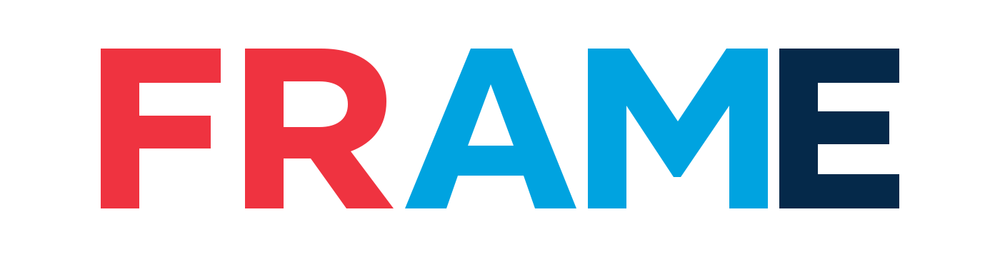

<p align="center">
  <picture>
    <source
      media="(prefers-color-scheme: dark)"
      srcset="./assets/header-dark.svg"
    >
    <source
      media="(prefers-color-scheme: light)"
      srcset="./assets/header-light.svg"
    >
    
  </picture>
</p>

AI agents can write code quickly. FRAME helps engineers and agents decide what to build, understand why, and check that it solves the problem.

FRAME is a lightweight engineering methodology for moving from a request to a result its evidence supports. Understand the outcome being asked for and the system it touches, resolve the uncertainty that could change the solution, and verify what was delivered against what was asked. The goal is to avoid premature implementation and repeated fixes built on the wrong assumption.

The methodology is independent of any AI model, development tool, programming language, or implementation framework. AI assists throughout the process; engineers remain responsible for the decisions.

## Core Philosophy

At the heart of FRAME is a simple idea:

> **Consideration before Implementation.**

FRAME guides engineering judgment. The requested outcome determines the work; uncertainty and verification needs determine the effort and the participants.

## How FRAME Works

FRAME names five engineering responsibilities:

1. **Foundation** — Understand the requested outcome, the constraints, and the existing behaviour that bears on them.
2. **Research** — Resolve the uncertainty that could change the solution.
3. **Align** — Assess the approach against the real implementation context and decide how to proceed.
4. **Materialize** — Carry out the authorised implementation.
5. **Evaluate** — Assess whether the deliverable satisfies the original request.

They are responsibilities rather than a fixed sequence of meetings or documents. Every task needs Foundation and Evaluate. A straightforward change can move from understanding to implementation and verification, with Research and Align taking a sentence each. A request for findings finishes at Evaluate with supported findings and no code. Work grows because a question is unresolved or a consequence is unverified, not because a task sounds serious — and the plan stays revisable when evidence shows the outcome needs related work.

FRAME contains only instructions and plugin metadata. The plugin itself runs no scripts or hooks, collects no telemetry, and requires no additional credentials.

## Research and Validation Helpers

FRAME starts with one accountable lead carrying all five responsibilities. Where the host supports subagents, that lead can add a helper when the helper has a concrete contribution to make:

- a **researcher**, when a substantial investigation benefits from its own context;
- a **validator**, when a separate assessment could expose consequential mistakes, omissions, or unsupported assumptions.

The two are independent choices: delegating the investigation does not commit the lead to delegating the assessment. The lead keeps the original request, decides the approach, writes the code, resolves reported findings, and remains accountable for completion. Helpers carry out the responsibility they were assigned, write no production code, and do not delegate further. Where subagents are unavailable or disabled, FRAME runs as a single agent and reports the verification it actually performed.

This revision of the methodology, and adaptive delegation in particular, is **experimental**. The hypotheses, the routing decisions each run records, and the measurements intended to establish whether any of it is worth its cost are described in [Adaptive delegation](docs/experiments/adaptive-delegation.md). Those measurements have not been carried out yet, so FRAME makes no claim that the current instructions, or delegation, improve quality, speed, or cost.

## Case Studies

Each case study runs the same engineering task twice on a real codebase: once with FRAME and once without it. Both runs use the same model, prompt, and starting code.

| Case study | Without FRAME | With FRAME | Difference | Review result |
| --- | ---: | ---: | ---: | --- |
| [Sudoku generator](docs/case-studies/sudoku-generator.md) | 4.5M tokens | 3.5M tokens | 22% fewer | FRAME preferred for largely retaining rotational symmetry |

Read the token figures as a record of those two runs, not as a measured saving. Each case study covers one task on one codebase at the FRAME version it names, and predates the current revision. The FRAME run was also made after the instructions had been refined using findings from earlier attempts at the same task, while the control was the original unguided run — so the comparison is not like-for-like, and a single pair of runs does not establish that FRAME improves quality or reduces cost. The measurements that could establish it are planned in [Adaptive delegation](docs/experiments/adaptive-delegation.md) and have not been carried out.

## Installation

Install FRAME as a plugin in Claude Code or Cursor.

### Claude Code

```text
/plugin marketplace add Zicrael/FRAME
/plugin install frame@frame
```

Run each command separately.

In the Claude desktop app, open the **Code** tab and enter the same commands in the prompt box.

Ask Claude to implement or change something. Claude can load FRAME automatically when the request matches the skill description. Explicit invocation is `/frame:frame`.

### Cursor

Install FRAME in Cursor and use it on the next real change. The plugin includes:

- An **always-applied rule** that detects implementation, change, debug, and refactor work — and investigation where the answer has to be established from the system rather than recalled — then loads the FRAME skill. It stays out of explaining existing code and simple lookup. After install the rule is set to Always; you can switch it to Agent Decides or Manual in **Customize**.
- The `/frame` skill, which runs the methodology.
- Two optional agents, `frame-researcher` and `frame-validator`, which the lead uses only when a helper has a concrete contribution to make.

Ask the agent to implement or change something. With the rule set to Always, FRAME applies on its own. Explicit: `/frame`. To keep it on for the session, run `/frame` with `Option+Enter` on macOS or `Alt+Enter` on Windows to use it as a Custom Mode.

### Full plugin (recommended)

Install FRAME as a local Cursor Plugin.

**macOS / Linux**

```bash
mkdir -p ~/.cursor/plugins/local
git clone https://github.com/Zicrael/FRAME.git ~/.cursor/plugins/local/frame
```

**Windows PowerShell**

```powershell
New-Item -ItemType Directory -Force -Path "$env:USERPROFILE\.cursor\plugins\local" | Out-Null
git clone https://github.com/Zicrael/FRAME.git "$env:USERPROFILE\.cursor\plugins\local\frame"
```

Restart Cursor or run **Developer: Reload Window**, then open **Customize → Plugins** and confirm that FRAME contains the rule, the `frame` skill, and the two agents.

> For Teams and Enterprise, local plugin imports can be disabled by an administrator.

### If local plugins are disabled

Install FRAME directly into the project instead:

```text
rules/*.mdc       → .cursor/rules/
skills/frame/     → .cursor/skills/frame/
agents/*.md       → .cursor/agents/
```

Cursor automatically discovers project rules, skills, and agents from these directories. Omit `agents/` to run FRAME as a single agent. Commit them if you want FRAME to be shared with the repository, or add .cursor/ to .gitignore to keep the installation local.

### Cursor Directory

FRAME is also listed on [Cursor Directory](https://cursor.directory/plugins/frame).

Cursor Directory currently installs the FRAME rule only. For the complete plugin with the `frame` skill, use the local plugin installation above.

## Support

Open a [GitHub Issue](https://github.com/Zicrael/FRAME/issues) for bugs, questions, or listing problems.

## Documentation

- [Principles](docs/principles.md)
- [Workflow](docs/workflow.md)
- [Adaptive delegation (experimental)](docs/experiments/adaptive-delegation.md)
- [Changelog](CHANGELOG.md)
